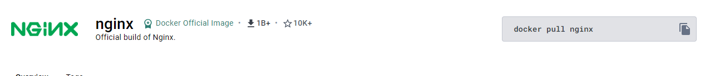
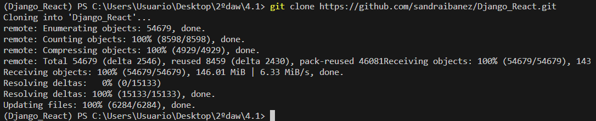
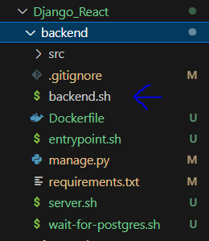
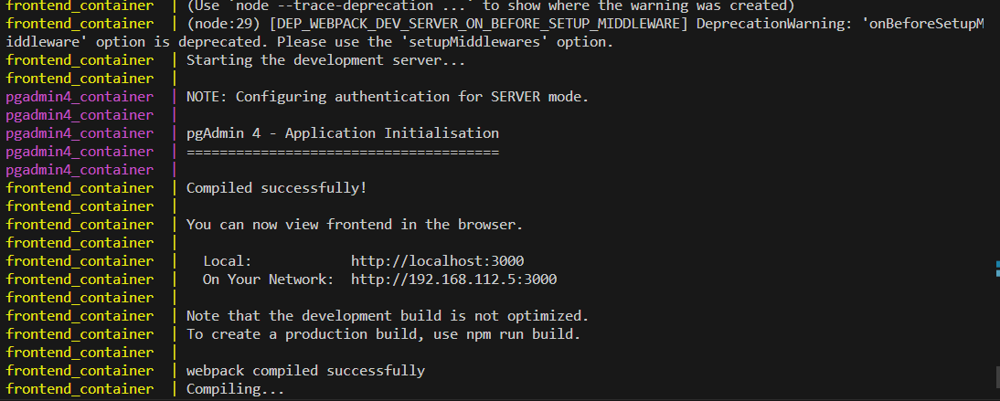
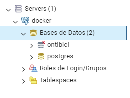

# Proyecto Dockerizado de React, Django, PostgreSQL y nginx en Windows

Este proyecto consiste en un entorno dockerizado que incluye React, Django, PostgreSQL y nginx.

# Índice

1. [Instalación de Docker](#1-Instalación-de-Docker)
2. [Imágenes necesarias](#2-Imágenes-Docker)
3. [Configuración del Proyecto](#3-Configuración-del-Proyecto)
4. [Creación de Contenedores](#4-Ejecución-del-Proyecto)
5. [Configuración del pgadmin](#5-configuracion-del-pgadmin)
6. [Comprobación del backend](#6-Comprobacion-del-backend)
7. [Comprobación del frontend](#7-Comprobacion-del-frontend)
8. [Puertos](#8-puertos)
9. [Problemas que he tenido](#9-Problemas-que-he-tenido)

# Pasos para probar el funcionamiento del proyecto

## 1. Instalación de Docker

Asegúrate de tener Docker instalado en tu sistema.

## 2. Imágenes Docker

Asegúrate de tener las imágenes Docker necesarias para el proyecto.

## 3. Configuración del Proyecto
Pasos para clonar el proyecto:

Cambia a la rama main_docker_compose situandote en el projecto colonado y mediante el comando `git checkout main_docker_compose`

Una vez clonado el proyecto, sigue los siguientes pasos:

### 3.1 Configuración del Backend

- Crea un nuevo archivo `.sh` en la carpeta del backend con el mismo contenido que el archivo denominado `backend.sh`.

Se crea el nuevo archivo:

  
  #### 3.1.1 Cambia el nombre del Dockerfile del backend

  Cambia el nombre del Dockerfile del backend donde aparece el nombre del backend.sh a exactamente el mismo nombre del archivo creado anteriormente para darle permisos y permitir que se ejecute.

Se cambia el nombre del archivo a por el nuevo:

  #### 3.1.2 Solución de problemas de conexión

  Si no se realizan el paso anterior, es posible que al iniciar los contenedores se muestre un mensaje de error de conexión en el contenedor del backend. En este caso, sigue estos pasos alternativos:
  - Hay que comentar esto del dockerfile sino dara error porque no encontrara el archivo
    
    
    
  - Accede a pgAdmin y realiza los pasos explicados más adelante [5](#5-configuracion-del-pgadmin).
  - Una vez dentro de pgAdmin, detén y vuelve a iniciar el contenedor del backend. Esto debería solucionar el problema. Es preferible que se haga el paso explicado en el apartado 3.1.1 y si se ha hecho esos pasos y aun asi persiste el problema intente realizar los pasos de este apartado el 3.1.2

   #### 3.1.3 Solucion de problemas del backend
   - Si haciendo los cambios del [3.1.1](#311-cambia-el-nombre-del-dockerfile-del-backend) aún así aparece el mismo problema del apartado [3.1.2](#312-Solución-de-problemas-de-conexión) hay que realizar la misma solucion que en el apartado 3.1.2
  

#### 3.2 Configuración del Frontend

- Elimina la carpeta `node_modules` del frontend.
  
  
  
- Desde la consola, en la ruta del frontend, ejecuta el comando `npm install` o `npm i` para reinstalar las dependencias y crear la carpeta `node_modules`.
  
  
  
- Sino realiza esos pasos al crear los contenedores el frontend mostrara por consola que tiene el sigiente error relacionado con `react-scripts` y no se iniciara el contendedor.

## 4. Ejecución del Proyecto

Una vez realizados los cambios anteriores, ejecuta el siguiente comando `docker-compose up` en la ruta donde se encuentra el archivo `docker-compose.yml` y se crearan las imagen, los volumenes y los contenedores

Una vez se esta creado deveria aparecer algo asi por consola:
  - Creacion de la imagen del backend
    
      

  - Creacion de la imagen del frontend

    

  - Creacion de los contenedores y de los volumenes:

    

    

    

    

    

    

    

    

    
    
    

    

    

    ### Creacion del contendor, las imagenes y de los volumenes

      

      

      

## 5. Configuracion del pgadmin

  -  Hay que poner el correo y la contraseña del .env usuario `sandrasoleribanez@gmail.com` contraseña `sandra2001`
    
      

      

  -  Elige el nombre que quieras para registrar el servidor

      
    
  -  En nombre/direccion del servidor hay que poner el nombre del contenedor del db en este caso `postgres_container`, la contraseña es `sandra2001` y el nombre de usuario es el de `postgres` aunque ponga sandrasoleribanez, sino se pone asi no funcionara

      

  - Una vez creado se vera algo asi:

    

  -  Al entrar en ontibici se vera algo asi:
    
     

  - Las tablas se veran asi:

    
    
## 6. Comprobacion del backend

  - Cuando entras se vera algo así y hay que poner `/api/` como se muestra en la imagen

    

  -  Cuando se pone `/api/` te muestra las rutas que puedes hacer
    

  -  Ejemplos de las rutas
    
    
    
    
    

## 7. Comprobacion del frontend

  -  En el frontend hay tres vistas en `rent` hay las 3 estaciones que estan en la base de datos.

      
     
  -  En el `home` no hay nada que mostrar solo el nombre de la pagina

      

  -  En el dashboard se muestran dos botones

      
     
      
     
      

## 8. Puertos

| contenedor | puerto  |
|------------|-------- |
|postgres    |5434:5434|
|pgadmin     |8888:80  |
|backend     |8000:8000|
|frontend    |3000:3000|
|loadbalancer-nginx|8080:8080|

## 9. Problemas que he tenido

He estado haciendo intentos para realizar la copia de seguridad de la base de datos de postgres, pero hasta ahora no he tenido éxito.

 

He probado varias opciones, pero todas resultan en un mensaje de error que indica que no se puede establecer una conexión TCP/IP.

Incluso he intentado verificar la conexión a la base de datos, pero el mismo error persiste.

 

Aparentemente, Postgres está funcionando correctamente:

 

 
 
Sin embargo, a pesar de que la base de datos está activa, no puedo realizar la copia de seguridad debido a este problema de conexión.

Aunque he utilizado el siguiente comando para intentar realizar la copia de seguridad:

Y he confirmado que hay datos en las tablas:

Sigo sin éxito. Parece que las tablas en pgAdmin están vacías, y aunque intento detener y reiniciar el backend, el proceso de migración se realiza sin ningún problema. Esto sugiere que el archivo no está siendo reconocido, a pesar de que la ruta está configurada correctamente.
 

